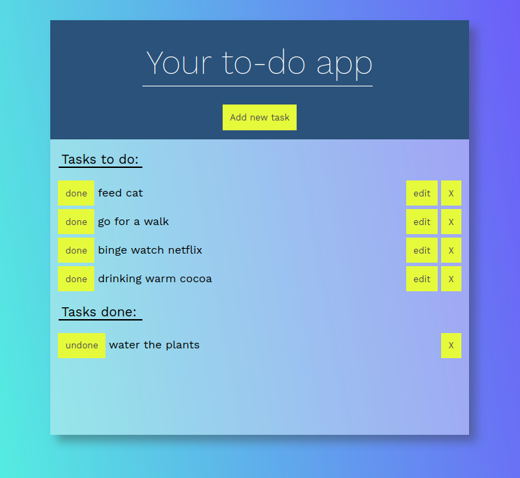

# React to-do app

## Live demo

👉 [Click here](https://olafro.github.io/React-to-do/) 👈

## About

Simple exercise to practice React functionalities.

Add a new task to the list. It will appear in the "Task to do" block. If it's
done, you can move it to the "Tasks done" section, by clicking "done". If You
want to go back, just click "undone". The tasks can be edited or deleted.

## Technologies used

- React
- React Components
- React State and Props

## Clone the repo and install the app:

    $ npm install
    $ npm start

(Runs the app in the development mode. Open
[http://localhost:3000](http://localhost:3000) to view it in the browser.)
